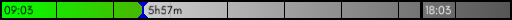
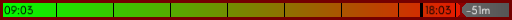

<h2 align="center">Time to <i>Go Home</i> :clock10:</h2>
<p align="center">
	<a href="https://github.com/fgrosse/go-home/releases"></a>
	<a href="https://github.com/fgrosse/go-home/blob/master/LICENSE"></a>
</p>

---

Go Home is a small OpenGL based progress bar widget for your Desktop that
displays for how long you have been working each day. This is helpful for people
who tend to loose track of time and thus do overhours when they actually wanted
to leave home. I made this to learn a bit about simple OpenGL programming using
[the Go programming language][go].

<p align="center">


</p>

## Installation

### Precompiled binaries

You can find precompiled binaries at the [releases] page of the GitHub
repository.

### From Source

You need to make sure you have all external dependencies (i.e. OpenGL bindings)
installed as explained at the [GLFW repository][external-deps].
There is a [Makefile](Makefile) to install the requires libraries on Fedora.

Go Home is packaged using [Go modules][go-modules]. You can simply go get it
with a a recent version of Go installed:

```
go get github.com/fgrosse/go-home
```

## Usage

You can start the program without any arguments which will create an
undecorated window that displays when you started the program the first time
today and when its time to go home. The default configuration assumes you are
working 8 hours a day and do 1 hour of lunch break.

As time goes by the progress bar will slowly fill up from green to red. If you 
are working overtime it will start to pulse red to catch your attention. At this
point you should leave home and enjoy your free time with your family and
friends :relaxed:.

### Configuration

Go Home reads configuration from `$HOME/.go-home.yml`. If this file does not
exist on the first start it will be created using sensible default values.
The available options in there should be pretty self explanatory.

## Built With

* [pixel](https://github.com/faiface/pixel) - A hand-crafted 2D game library in Go
* [glfw](https://github.com/go-gl/glfw) - Go bindings for GLFW 3
* [cobra](https://github.com/spf13/cobra) - A Commander for modern Go CLI interactions 
* [zap](https://github.com/uber-go/zap) - Blazing fast, structured, leveled logging in Go
* [pkg/errors](https://github.com/pkg/errors) - Simple error handling primitives
* [gopkg.in/yaml](https://gopkg.in/yaml.v3) - YAML support for the Go language 
* [Glacial Indifference Font](https://fontlibrary.org/en/font/glacial-indifference) - An open source typeface by Alfredo Marco Pradil ([SIL Open Font License](LICENSE_FONT))

## Contributing

Please read [CONTRIBUTING.md](CONTRIBUTING.md) for details on the code of
conduct and on the process for submitting pull requests to this repository.

## Versioning

This software uses [SemVer] for versioning.
For the versions available, see the [tags on this repository][tags]. 

## Authors

- **Friedrich Große** - *Initial work* - [fgrosse]

See also the list of [contributors] who participated in this project.

## License

This project is licensed under the BSD-3-Clause License - see the [LICENSE](LICENSE) file for details.

[releases]: https://github.com/fgrosse/go-home/releases
[external-deps]: https://github.com/go-gl/glfw/blob/master/README.md
[go]: https://golang.org
[go-modules]: https://github.com/golang/go/wiki/Modules
[SemVer]: http://semver.org
[tags]: https://github.com/fgrosse/go-home/tags
[fgrosse]: https://github.com/fgrosse
[contributors]: https://github.com/github.com/fgrosse/go-home/contributors
